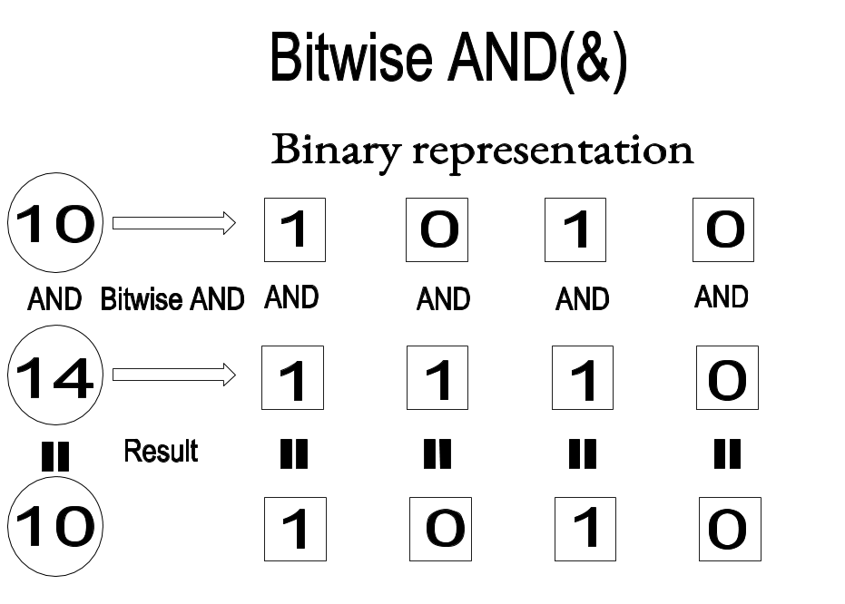
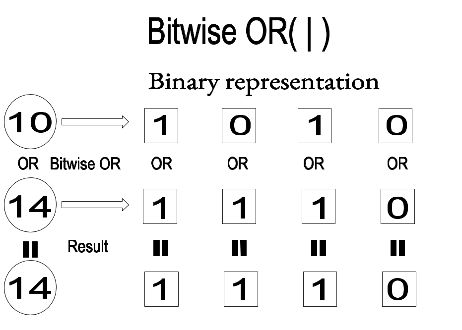
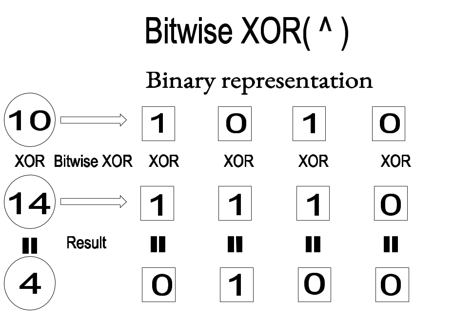
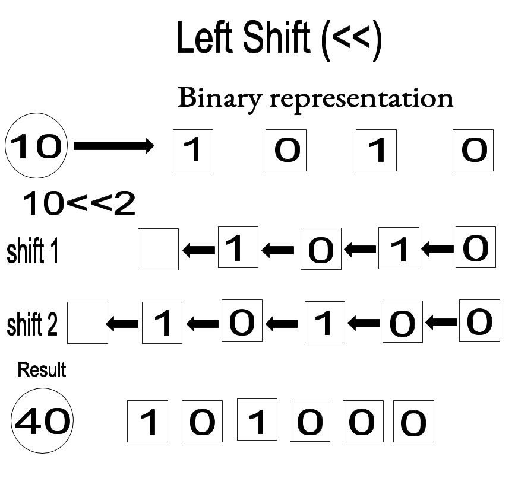
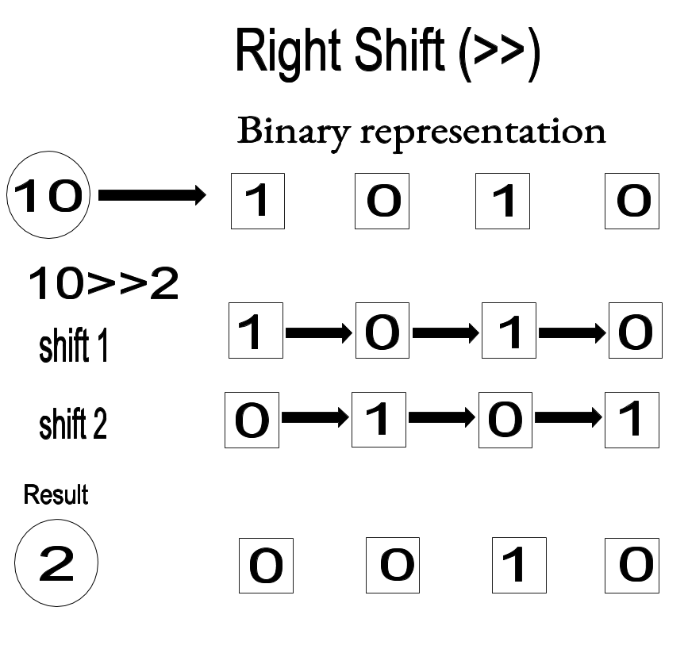

# Getting Started
## Using python shell
  - Open terminal (ctrl+alt+t). 
  - Type:
```sh 
$ python
``` 
- If you have python 3 then type:
```sh
$ python3
``` 
 This will open python shell in your terminal.  
 
```sh
>>>
```

Lets tryout a simple python code to print  "Unlock the world of security",  all you need is to use print function.

- open terminal and type: 

```sh 
$ python3
>>> print("Unlock the world of security")
``` 
- In case of python 2 the above syntax will also work along with the following syntax :
```sh
$ python
>>> print "Unlock the world of security" 
``` 
The output will be displayed in the python shell as: 
```sh
>>> Unlock the world of security
``` 

## Basic Data Types
- Integer       eg: -4, 0, 32 
- Float         eg: -44.3, 0.55, 7.0
- Complex       eg: 3+2i, 4-i, -2-3i
- Boolean       true or false
- String        eg: 'Smile', '44', 'disc0ver'

> To check the datatype, python has built in function type().

```sh
>>> n=1729
>>>type(n)
<class 'int'>
>>>s="H4cker"
>>>type(s)
<class 'str'>
>>>f=17.29
>>>type(f)
<class 'float'>
```
Convertion to a valid datatype is possible with the help of typecasting.

```sh
>>>f=212.34
>>>int(f)
212
>>>num=33
>>>float(num)
33.0
```
# Basics
 ### I/O Methods 
 
For taking input:
```sh
$ python
>>>raw_input()
this is taken as input 
'this is taken as input'
``` 
> In python3, there is no need for raw_input(). 

```sh
$ python3
>>>input()
this is taken as input
'this is taken as input'
```
> By default input is taken as string.

```sh
>>>n=input()
3
>>>print(type(n))
<class 'str'>
```
To convert the datatype, we need to typecast it separately.
> Typecast: Converting the datatype of a variable from one to another.

```sh
>>>n=int(input())
3
>>>print(type(n))
<class 'int'>
```
In a similar way we can change the data type from int to float  and many more.
***
- ***In all the above cases, if python 2 is used then, in place of input() use raw_input().***

- ***For print statememt in python3, the synatx is ```>>>print("Secure") ```. While in python 2, there is no need of parenthesis () but it wont show any error even if we use parenthesis (). It is ```>>>print "Secure" ``` ```>>>print ("Secure" )``` or .***
***

## Operations 

```sh
>>> a=5
>>> b=6
>>>a + b
11
>>>a - b
-1
>>>a * b
30
a/b
0.8333333333333334
>>>a//b
0
>>>a % b
5
>>>a ** b
15625
```

-  // shows the quotient.
-  % show the remainder.
-  ** is a to the power b or a raised to b.

In python 2 when '/ ' operation is used, the integer is printed while in case python 3 it will show value after decimal place also. So to obtain the float value in python 2 you need to specify atleast one, either denominator or numerator as float.

```sh 
$ python
>>> 3/2
1
>>>3.0/2
1.5
```

## Comparision operators: 
- a == b 
Equal to condition.
- a < b 
Less than condition. 
- a > b
Greater than condition.
- a <= b
Less than or equal to condition.
- a >= b
Greater than or equal to condition. 
- a != b
Not equal to condition.

## Assignment Operator '='

a=b the value of b is assigned to a.

## Binary Operations

 To understand this, use python built in funtion ```$ bin(n)```. It will show the binary form of number n.
 ```sh 
>>> bin(3)
'0b11'
>>> bin(2)
'0b10'
```
#### a&b bitwise AND of a,b:

```sh 
>>> 3&2
2
```
Each bit is taken taken and AND opeartion is performed.
so the result we get is 0b010, which is 2. 



#### a|b bitwise OR of a,b:
```sh 
>>> 3|2
3
```
Each bit is taken and OR opeartion is performed.
so the result we get is 0b11, which is 3. 



#### a^b bitwise XOR of a,b:
```sh 
>>> 3^2
1
```
Each bit is taken and XOR opeartion is performed. In XOR, if both bits are same then the result is 0, else 1. So 1^1 is 0 while 1^0 is 1.
Hence, the result we get for 3^2 (0b11^0b10) is 0b001, which is 1. 



#### a<<b it will shift the bits of a in binary format to left, this shift is done b times: 
```sh 
>>> 3<<2
12
>>>bin(12)
0b1100
```
Binary representation of 3 is 0b11, which is shifted twice to left. So the result is 0b1100 that is 12.



#### a>>b it will shift the bits of a in binary format to right, this shift is done b times:
```sh 
>>> 3>>1
1
```
Binary representation of 3 is 0b11, which is shifted once to right. So the result is 0b1 that is 1.




Python can also understand logical operations when written in english :
- and
- or
- not 
- in


## Conditional Statements

### if statements

        
If condition statements are to be used when you have a set of statements which is to be executed when a particular condition is satisfied. 
 For example if a person's age is above 18, he is eligible to vote. If not, he is not eligible to vote. 

Example 1 

```sh 
$ python3
>>>age=int(input())
32
>>>if(age>=18):
...    print(“you are eligible to vote”)
...else:
...    print(“you are not eligible to vote”)
``` 
Press enter button twice for output.

### Output

```sh 
you are eligible to vote
>>>
``` 
Example 2

```sh 
$ python
>>>age=int(raw_input())
32
>>>if age>=18:
...    print “you are eligible to vote”
...else:
...    print “you are not eligible to vote”
```
Press enter button twice for output.

### Output

```sh 
you are eligible to vote
>>>
```
Example 3

If we have more than one condition to check we can use elif statements.

```sh 
$ python3
>>>age=int(input())
32
>>>if(age<=12):
...     print(“you are a kid”)
...elif(age>12 and age <= 19):
...     print (“you are a teenager”)
...elif(age >19 and age < 30 ):
...     print(“you are an adult”)
...else:
        print(“you are a senior citizen”)
``` 
Press enter button twice for output.

### Output
```sh 
you are a senior citizen
>>>
``` 
Example 4

```sh 
$ python
>>>age=int(raw_input())
32
>>>if age<=12 :
...     print “you are a kid”
...elif age>12 and age <= 19 :
...     print “you are a teenager”
...elif age >19 and age < 30 :
...     print “you are an adult”
...else:
        print “you are a senior citizen”
```
Press enter button twice for output.

#### Output
```sh 
you are a senior citizen
 >>>
 ```

## Loops

### For loop 
It is used when you need to execute a set of statements n times.
Syntax :
```sh
for variable in range(start,end,incrementation):
    statments
```
If not mentioned then starting is taken as 0 and incrementation as 1 to the specified end point.

This code is valid for both python 3 and python 2.

Example 1

```sh 
$ python
>>>for i in range(3):
...     print(“welcome to the world of security”)

```

Press enter button twice for output.
#### Output
```sh
welcome to the world of security
welcome to the world of security
welcome to the world of security
>>>
```
Example 2

This code is valid for both python 3 and python 2.

```sh 
$ python3
>>>i = "teambi0s"
>>>for i in c:
...     print(i)
```
Press enter button twice for output.
#### Output
```sh
t
e
a
m
b
i
0
s
>>>
```

### While loop 

It is used to execute a set of statements until the condition is satisfied and hence the loop will end as the condition becomes false. 

Syntax :
```sh
while(condition):
    statments
```
Example 1

This code is valid for both python 3 and python 2.
```sh 
$ python3
>>>flag=0
>>>while(flag!=3):
...     print(flag)
...     flag=flag+1
```
Press enter button twice for output.

#### Output
```sh 
0
1
2
>>>
```

### Nested Loops: 

Loop inside a loop is termed as nested. 

This code is valid for both python 3 and python 2.
```sh 
$ python3
>>>for i in range (3):
...     for j in range (2):
...         print(“this is nested”)
```
Press enter button twice for output.

#### Output

```sh 
this is nested
this is nested
this is nested
this is nested
this is nested
this is nested
>>>
```


It will print 6 times.


